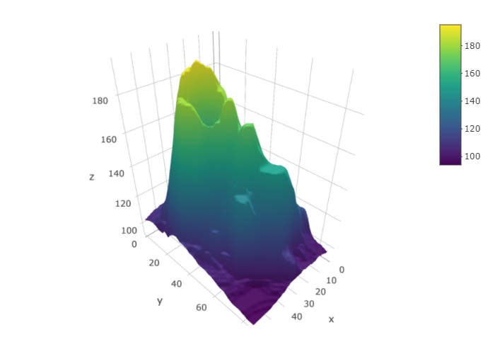
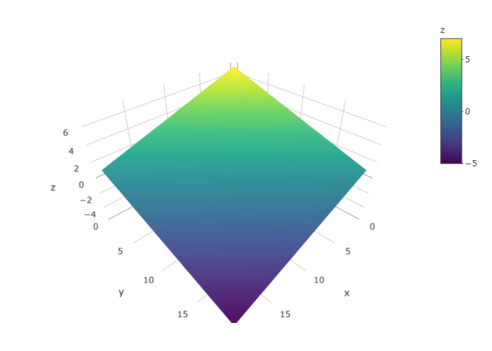
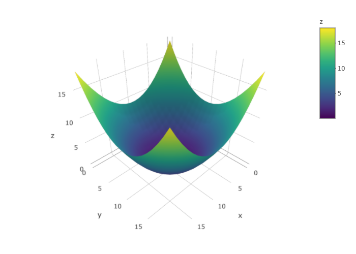
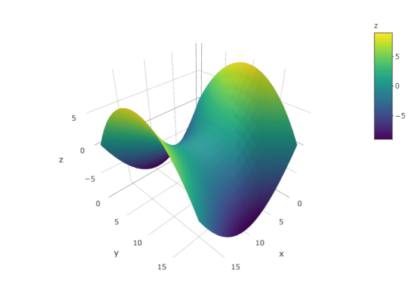
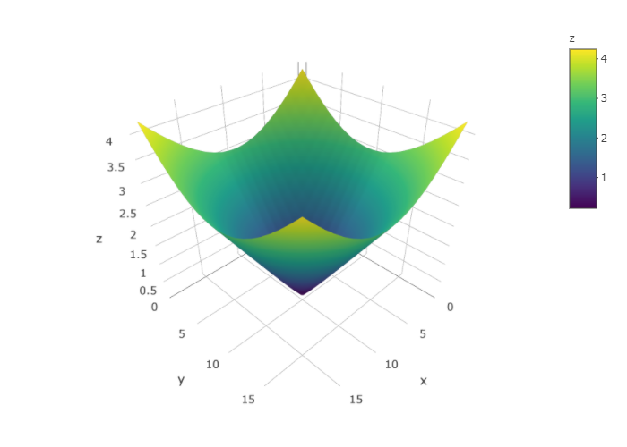

# Les fonctions de plusieurs variables {#fctvar}

```{r libraries-fctvar,echo=FALSE}
library(plotly)
library(pracma)
```


## Introduction

Jusqu'à présent dans vos cours de calcul différentiel et intégral, nous n'avons étudié que les fonctions d'une seule variable, c'est-à-dire des fonctions de la forme $y=f(x)$. Nous avons appris à dessiner ces fonctions, à les dériver, à les intégrer, etc. Par contre, il est utile d'étudier les fonctions de plus d'une variable car la plupart des phénomènes étudiés dépendent de plus d'un paramètre.

Dans ce chapitre, nous reprendrons les différents thèmes étudiés sur les fonctions d'une seule variable, pour les généraliser sur les fonctions de plusieurs variables.

## Définitions

Débutons en rappelant le concept de fonction et en le généralisant aux fonctions de deux variables ou plus.

```{definition,name="Fonction"}
Soit un ensemble $A$ et un ensemble $B$. Une fonction $f$ est une application qui pour chaque élément
$x\in A$  lui associe un seul élément $y\in B$. On note cette fonction 
\begin{align*}
f:\ A&\longrightarrow  B\\
x&\longrightarrow  y=f(x)
\end{align*} 

  - L'ensemble $A$ se nomme \textbf{domaine} de $f$, noté $\text{dom}(f)$.
  - L'ensemble $B$ est le \textbf{codomaine} de la fonction $f$, noté $\text{codom}(f)$.


```

```{definition,name="Image d'une fonction"}
L'image d'une fonction est l'ensemble de tous les éléments du codomaine qui sont obtenus par la fonction $f$. Nous notons l'image $\text{ima}(f)$. En langage mathématique, l'image s'écrit comme suit:
\begin{align*}
\text{ima}(f):=\{y|y=f(x),\forall x\in dom(f)\}
\end{align*}
Il est à remarquer que $\text{ima}(f)\subseteq \text{codom}(f)$. 
```

La distinction entre l'image et le codomaine est représentée à la figure \@ref(fig:representationfonction). Le codomaine est l'ensemble $B$ tandis que l'image est l'ensemble de tous les éléments de $B$ qui sont reliés à
un ou plusieurs éléments de $A$ par la fonction (ici l'image est la région ombragée).

```{r,echo=FALSE,fig.align="center",label="representationfonction",out.width="50%",fig.cap="Graphique saggital représentant une fonction."}

```

Jusqu'à maintenant, nous avons étudié les fonctions ayant comme domaine un sous-ensemble de la droite des réels. Dans ce cours, nous étudierons des fonctions ayant comme domaine un sous-ensemble $\mathbb{R}^n$, où $n\in\mathbb{N}$. En langage mathématique, ces fonctions s'écrivent:
\begin{align*}
f: D\subseteq \mathbb{R}^n &\longrightarrow \mathbb{R}\\
(x_1,..,x_n)&\longrightarrow z=f(x_1,..,x_n)
\end{align*}
où $x_1$, ..., $x_n$ sont $n$ variables indépendantes.

## Graphique

Lorsque nous avons une fonction $y=f(x)$, son graphe correspond à une courbe dans le plan cartésien, c'est-à-dire dans $\mathbb{R}^2$. Pour parvenir à dessiner cette courbe, on fait correspondre une valeur de $y$ pour chaque valeur de $x$.

Lorsque nous somme en présence d'une fonction de deux variables $z=f(x,y)$, le graphique de cette fonction est une surface dans l'espace de trois dimensions, $\mathbb{R}^3$.

Par contre, lorsque notre fonction possède plus de deux variables, il devient difficile, voire impossible de la représenter graphiquement. Il faudrait utiliser des espaces de plus de trois dimensions.

```{remark}
Dans le cadre de ce cours, nous nous en tiendrons à des fonctions de une, deux ou trois variables.
```

La figure \@ref(fig:point3d) montre de quelle façon nous pouvons représenter le point (a,b,f(a,b)) dans l'espace à trois dimensions.

```{r point3d,echo=FALSE,fig.align="center",label="point3d",out.width="50%",fig.cap="Représentation en trois dimensions d'un point."}
knitr::include_graphics("resources/images/latex/point3d.png")
```

Nous allons maintenant présenter plusieurs fonctions accompagnées de leur graphique.

La figure \@ref(fig:volcano) représente l'information topographique relative au volcan *Maunga Whau* situé en Nouvelle-Zélande.

```{r volcano,echo=FALSE,fig.align="center",label="volcano",out.width="80%",fig.cap="Représentation en trois dimensions d'une fonction de deux variables."}
if (knitr:::is_html_output()){
  plot_ly(z=volcano) %>% add_surface()
} else {
  
}
```

Les figures suivantes représentent des fonctions usuelles.

```{r plan,echo=FALSE,fig.align="center",label="plan",out.width="80%",fig.cap="Plan : $z=1-x-y$"}
xy <- meshgrid(linspace(-3,3,20))
x <- xy$X
y <- xy$Y
z <- 1-x-y
if (knitr:::is_html_output()){
  plot_ly(x=x,y=y,z=z) %>% add_surface()
} else {
  
}
```

```{r ,echo=FALSE,fig.align="center",label="paraboloide",out.width="80%",fig.cap="Paraboloïde: $x=x^2+y^2$"}
xy <- meshgrid(linspace(-3,3,20))
x <- xy$X
y <- xy$Y
z <- x^2+y^2
if (knitr:::is_html_output()){
  plot_ly(z=~z) %>% add_surface()
} else {
  
}
```

```{r ,echo=FALSE,fig.align="center",label="hyperboloide",out.width="80%",fig.cap="Hyperboloïde : $z=x^2-y^2$"}
xy <- meshgrid(linspace(-3,3,20))
x <- xy$X
y <- xy$Y
z <- x^2-y^2
if (knitr:::is_html_output()){
  plot_ly(z=~z) %>% add_surface()
} else {
  
}
```

```{r ,echo=FALSE,fig.align="center",label="cone",out.width="80%",fig.cap='Cône : $z=\\sqrt{x^2+y^2}$'}
xy <- meshgrid(linspace(-3,3,20))
x <- xy$X
y <- xy$Y
z <- sqrt(x^2+y^2)
if (knitr:::is_html_output()){
  plot_ly(z=~z) %>% add_surface()
} else {
  
}
```

## Domaine

